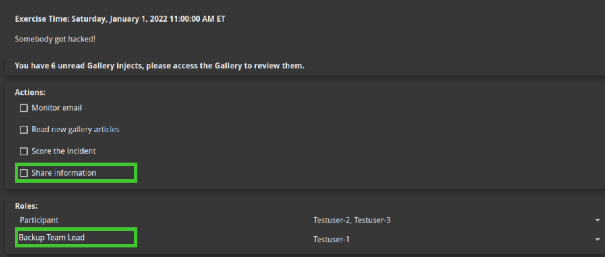

# CITE Dashboard

The dashboard shows exercise details like the date and time, incident summary, a suggested list of actions for participants to consider taking, and suggested participant roles.

##Actions to Consider and Roles

Participants who can submit scores on behalf of their team also can add **suggested actions** and **participant roles** to the **CITE dashboard**. The use of actions and roles will allow your team to customize their response by tracking tasks and roles during the exercise. These actions and roles remain internal to your team and will not be visible to other participants.

In figure below, notice that there is one **action** to consider and one role. 

Assuming that you have been granted the appropriate permissions by the exercise administrator, follow these steps to add an **Action**.

1. In the top-right corner, click the **Administration** gear icon.
2. Click **Add Action** and enter an **Action Description**.
3. Your team appears by default. You can only add a new action for your team.
4. Click **Save**.

When you return to the CITE Dashboard, your new action appears under Actions to consider. Actions are added per move.
Assuming that you have been granted the appropriate permissions by the exercise administrator, follow these steps to add a new **Role**.

1. In the top-right corner, click the **Administration** gear icon.
2. Select **Roles**, then click **Add Role**.
3. Enter a new **Role Name**. Your team appears by default. You can only add a new role to your team.
4. Click **Save**.

When you return to the CITE Dashboard, your new role appears under Roles, ready for a user (participant) to be assigned to it. Roles are added *per incident*.

The figure below highlights the newly created action and role.

