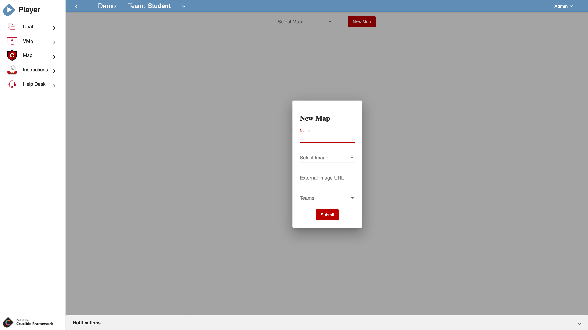

# Player Maps

The **Maps** application allows Player users who have View Administrator (*ViewAdmin*) permissions on the view to create, edit, and delete "clickable" maps of systems and environments in a simulation. A common example of a map is a network topology where selecting a system on the topology launches the associated VM.

Assuming that View Administrator permissions have been granted, in Player add the map application to the view.

## Adding the Map application to the view

1. In Player, in your present view, select your user name and then **Edit View**.
2. Under Applications, select **Add New Application** then **Templates**, then **Map**.
3. The Select Map dropdown and the New Map icon appear in the right pane.

## Creating a new map

1. In the newly created Map application, in the right pane, select **New Map**.
2. Complete the following fields:
   - **Name:** the name of the map.   
   - **Select Image:** from the dropdown, select an image. The images you see here are images that have been previously uploaded to the view by the View Admin and assigned to a team.   
   - **External Image URL:** enter the URL of an external image if no image has been attached to the view or if you want to use a different image than what is available.   
   - **Teams:** only the teams selected here will see the new map.   
   > Note that you can select more than one team here.
3. Click **Submit**. The image of the new map appears in the right pane.

## Editing a map

1. In Player's left navigation pane, click the **Map application**. 
2. In the right pane, select a map from the **Select Map** dropdown.
3. Click the **Edit** icon. From here, you can:
   - **Edit Properties:** allows you to change the name, images, and teams of the map.
   - **Discard Changes:** allows you to discard changes you made to the map; for example, adding a click point.
   - **Save:** saves your map.
   - Click in the map to **add a click point**.

### Adding a click point

A _click point_ is a location on the map that when clicked by Player user launches a resource like a virtual machine in a new tab. To add a click point to the map:

1. In Player's left navigation pane, click the **Map application**. 
2. In the right pane, select a map from the **Select Map** dropdown.
3. Click the **Edit** icon.
4. Click anywhere in the map to launch the **Add Click Point** modal. If your map is a network topology diagram with network elements--routers, switches, firewalls, servers, etc.--then you may want to click on an element that represents the VM resource you want the user to launch. 
   - **Radius:** by default, the value is 3.
   - **Resource:** this is the virtual machine (or another map) that launches when clicked. The VMs that appear here are the VMs from the VM application in the current view.
   - **Enter Custom Resource URL:** enable this if you want to link to something other than the view's VMs and maps that are available above. For example, you could place a click point labeled "Linux Help" that links to relevant Linux documentation.
   - **Label:** this is how the click point is labeled on the map. If your click point is over top of an element that launches a Windows 10 Administrator Workstation, then it makes sense to label it "Win 10 Admin".
5. Click **Save** to save the new click point in the map.
6. Click **Save** again to save the map.

### Deleting a click point

1. In Player's left navigation pane, click the **Map application**. 
2. In the right pane, select a map from the **Select Map** dropdown.
3. Click the **Edit** icon.
4. Click an existing click point.
5. In the Edit Click Point modal, click **Delete**.

## Deleting a map
1. In Player's left navigation pane, click the **Map application**. 
2. In the right pane, select a map from the **Select Map** dropdown.
3. Click **Delete Map**.
